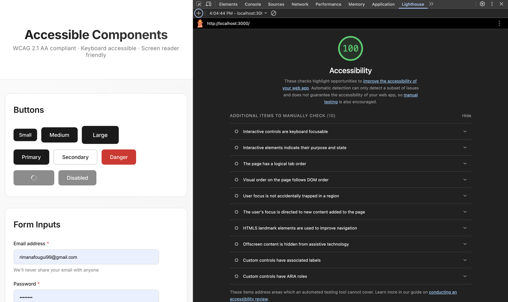

# Accessible Component Library

A production-ready React component library built with accessibility-first principles following WCAG 2.1 AA standards.

## Features

- **Fully Accessible**: WCAG 2.1 AA compliant with proper ARIA attributes
- **Keyboard Navigation**: Full keyboard support (Tab, Enter, Escape, Arrow keys)
- **Screen Reader Friendly**: Semantic HTML with descriptive labels
- **TypeScript**: Type-safe props and interfaces
- **Focus Management**: Visible focus indicators and focus trapping
- **Responsive**: Works on all device sizes

## Components

### Button

- Multiple variants (primary, secondary, danger)
- Loading states with visual indicators
- Disabled state handling
- Proper focus management

### Input

- Associated labels with htmlFor
- Error and helper text support
- Required field indicators
- ARIA descriptions

### Modal

- Focus trap implementation
- ESC key to close
- Click outside to dismiss
- Scroll lock when open
- Restores focus on close

## Running Locally

\`\`\`bash
npm install
npm start
\`\`\`

## Testing

Run accessibility tests:
\`\`\`bash
npm test
\`\`\`

## Accessibility Checklist

- ✅ Keyboard navigation
- ✅ Screen reader support
- ✅ Focus management
- ✅ ARIA attributes
- ✅ Color contrast (4.5:1 minimum)
- ✅ Touch target size (44x44px minimum)
- ✅ Error messages announced
- ✅ Loading states communicated

## Technologies

- React 18
- TypeScript
- CSS Modules
- React Testing Library
